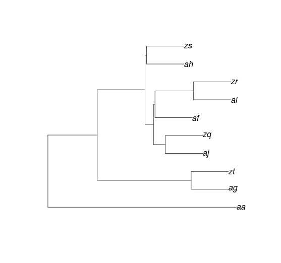

---
title: '$4^{th}$ progress report'
...

Introduction
============

A first shareable version of the R code is included with this report.
The code (described on last report) was implemented with:

-   A `phyl()` function, which simulate a tree with rates generated by
    any of the three models described on next section of this report.

-   An iterative method which estimate MLE values for a set of
    simulated trees.

Moreover, the code generates the tree on Newick format as well for
visual and topological analysis purposes.

Approach & questions
====================

Rates
-----

We implement the model described on the previous reports, which
considers the speciation and extinction rates as functions of traits
depending on time $ \lambda_i = f(traits)$ and $\mu_i = f(traits)$.\
On this report we include two more models besides the loglinear, so we
have the following three models:

-   $$\lambda_i = e^{\theta_0 + \theta_1 a_i}$$
    $$\mu_i = e^{\varphi_0 + \varphi_1 a_i}$$

-   $$\lambda_i = \theta_0 + \theta_1 a_i$$
    $$\mu_i = \varphi_0 + \varphi_1 a_i$$

-   $$\lambda_i = \frac{\theta_0}{1+e^{-\theta_1 a_i}}$$

Questions:
----------

-   Does the loglineal, linear and logistic models makes any biological
    sense?, It is ok to have same $f()$ for both, $\lambda$ and $\mu$?

-   Would be a non-parametric approach a better alternative of those
    models?

-   Why would we prefer this framework instead of the differential
    approach of Nee et al. ?

Implementation
==============

Simulation
----------

We use the `phyl()` function to simulate trees, an exaple of a
10-iteration phylogenetic tree would be:

        s1 = phyl(nT=10, model = "loglinear")
        

We simulated 1000 different trees with same parametes and we estimated
it using MLE. A summary of the estimated values for each model is
described included bellow. In general we have similar results given in
the last report.

           n   real value    mean   median        min       max
  --- ------ ------------ ------- -------- ---------- ---------
    1   1000         3.00    3.00     2.98       0.62      5.81
    2   1000         4.00    5.03     3.95    -591.87   2410.71
    3   1000         1.00    1.56     0.87     -13.42    347.45
    4   1000         2.00   -1.03     1.63   -4045.67   2003.04

  : Model 1

              n   real value    mean   median        min       max
  --- --------- ------------ ------- -------- ---------- ---------
    1   1000.00         3.00    2.83     2.85     -15.46     17.76
    2   1000.00         4.00   13.43     3.87   -4131.72   3329.81
    3   1000.00         1.00    1.02     0.94     -15.02     18.60
    4   1000.00         2.00   -5.88     1.60   -7333.90   3473.38

  : Model 2

              n   real value    mean   median        min       max
  --- --------- ------------ ------- -------- ---------- ---------
    1   1000.00         3.00    4.55     3.34       1.39     63.37
    2   1000.00         4.00   10.09     2.02   -1118.53   2702.20
    3   1000.00         1.00    2.64     1.07       0.34    180.18
    4   1000.00         2.00   -0.75     1.46   -3027.31   2999.15

  : Model 3

Analysis
--------

Some visual analysis tools are also provided with the code, we used them
to find relationships between “bad” estimations and both, numerical and
topological data.

After comparison we found no relationship betwen particular
caracteristics of the trees and non accurate estimations.

