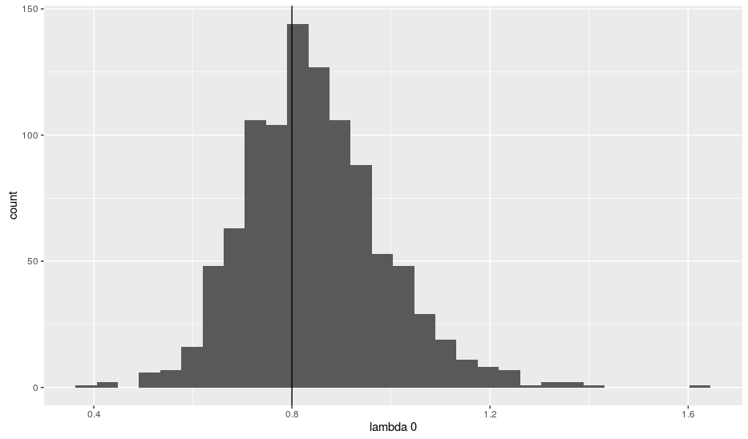
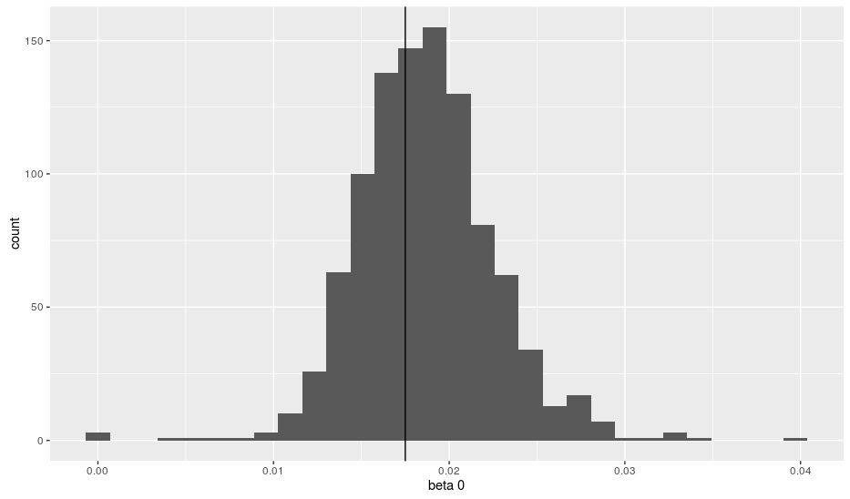
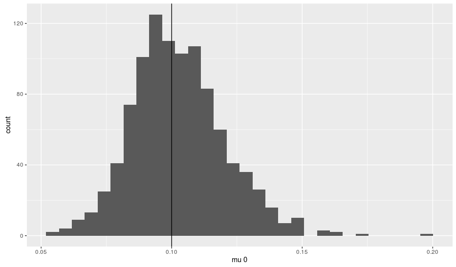
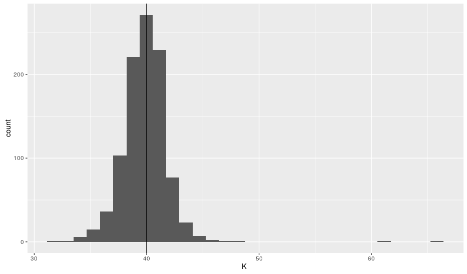

<!DOCTYPE html PUBLIC "-//W3C//DTD XHTML 1.0 Transitional//EN" "http://www.w3.org/TR/xhtml1/DTD/xhtml1-transitional.dtd">
<html xmlns="http://www.w3.org/1999/xhtml">
<head>
  <meta http-equiv="Content-Type" content="text/html; charset=utf-8" />
  <meta http-equiv="Content-Style-Type" content="text/css" />
  <meta name="generator" content="pandoc" />
  <title>Report</title>
  
</head>
<body>

<h1 class="title">Report</h1>

<h1 id="summary" class="unnumbered">Summary</h1>

On this report we review the theory behind the diversity-dependence model under the framework described on the introductory essay. In the later section we show results of the algorithm. To materialize this theory we

<ul>
<li>
Write MLE code for diversity-dependence model
</li>
<li>
Paralellize the code
</li>
<li>
Create R package
</li>
</ul>
<h1 id="overview" class="unnumbered">Overview</h1>

We consider a phylogenetic tree, mathematicaly expressed as a set <em>Y</em> = (𝒯, <em>Υ</em>), where 𝒯 represent the set of branching times <a href="#fn1" class="footnoteRef" id="fnref1">1</a>, and <em>Υ</em> has the information of the topology of the tree. The markov nature of the process means that the likelihood is exaclty the product of the conditional densities <a href="#fn2" class="footnoteRef" id="fnref2">2</a>, in other words, the likelihood of the tree is then described as a multiplication of an exponenial distribution and a multinomial distribution

 $$L(\theta | Y) = \displaystyle\prod_{i}^N -\sigma_i(\theta) e^{-\sigma_i(\theta) t_i} \frac{\rho_i(\theta)}{\sigma_i (\theta)}$$  thus, the log-likelihood is  $$l(\theta | Y) = \displaystyle\sum_{i}^N -\sigma_i(\theta) t_i + log (\rho_i(\theta))$$ 

<h2 id="diversity-dependence-model" class="unnumbered">Diversity-dependence model</h2>

For the simplest diversity-dependence model

 $$\lambda_{i,j} = \lambda_0 - (\lambda_0 - \mu_0)\frac{n_i}{K}, \qquad \mu_n = \mu_0$$ 

The MLE can be finded partialy analiticaly and partialy numerically. First we consider <em>σ</em><em>i</em> and <em>ρ</em><em>i</em>

 $$\sigma_i  = \sum_{j=1}^{N}  \lambda_0 - (\lambda_0 - \mu_0)\frac{n_i}{K} + \mu_0 
         = n_i(\lambda_0 + \mu_0) - n_i^2\beta_0$$ 

where $ \beta_0=\left(\frac{\lambda_0-\mu_0}{K}\right)$, and

 <em>ρ</em><em>i</em> = <em>E</em><em>i</em>(<em>λ</em>0 − <em>n</em><em>i</em><em>β</em>0)+(1 − <em>E</em><em>i</em>)<em>μ</em>0 

Here, <em>n</em><em>i</em> is defined as the number of species at time <em>t</em><em>i</em> and <em>E</em><em>i</em> is a binary vector with 1 if there was an speciation at time <em>t</em><em>i</em> or 0 is there was an extinction at time <em>t</em><em>i</em>.

Thus, seeking for the MLE values, we analyze the thee equations  $$\begin{cases} \frac{\partial l(\lambda,\beta,\mu | Y)}{\partial \lambda} = 0 \\
                \frac{\partial l(\lambda,\beta,\mu  | Y)}{\partial \beta} = 0 \\
                \frac{\partial l(\lambda,\beta,\mu  | Y)}{\partial \mu} = 0 
\end{cases}$$ 

Firstly, after some algebra, we find a very nice analytical solution for the extinction rate parameter  $$\label{mu}
 \frac{\partial l(\lambda,\beta,\mu | Y)}{\partial \mu} = 0  \Leftrightarrow \hat{u}_0 = \frac{\displaystyle\sum_{i=1}^N (1-E)}{\displaystyle\sum_{i=1}^N(n_it_i)}$$  Moreover, with the other two equations, we have the following system  $$\begin{cases} \displaystyle\sum_{i=1}^N \frac{E_i}{\lambda-n_i\beta} = \displaystyle\sum_{i=1}^N n_i t_i \\ \displaystyle\sum_{i=1}^N \frac{E_in_i}{\lambda-n_i\beta} = \displaystyle\sum_{i=1}^N n^2_i t_i \end{cases}$$ 

A numerical efficient method to solve this system is described in the appendix.

<h1 id="algorithm" class="unnumbered">Algorithm</h1>

Under the previous results, we developed an algorithm able to find accurate solution for the MLE. The algorithm is based on the following formulation.

Step 1. get $\hat{\mu_0}$ using eq [mu]. 
Step 2. Consider the function

 $$\hat{\beta}(\lambda) = \displaystyle\operatorname*{arg\,max}_{\beta} L(\lambda,\beta,\hat{\mu}_0)$$  
Step 3. Calculate the MLE such that,

 $$(\hat{\lambda},\hat{\beta},\hat{\mu}) =  \displaystyle\operatorname*{arg\,max}_{\lambda}L(\lambda,\hat{\beta}(\lambda),\hat{\mu})$$ 

Two important properties of this algorithm ensures convergence (the writting of the proof is pending):

<ol>
<li>
$ \hat{\beta}(\lambda)$ is a linear function of <em>λ</em>
</li>
<li>
$\displaystyle\operatorname*{arg\,max}_{\lambda}L(\lambda,\hat{\beta}(\lambda),\hat{\mu})$ is a convex funcion of <em>λ</em>.
</li>
</ol>

This two results ensures the existence of an unique global maximum, which is easily calculated by several classic optimization methods.

As an example, on figure [hists] we can see the estimations over 1000 simulations of the diversity-dependence process with true values <em>λ</em>=0.8, <em>β</em>0 = 0.0175, <em>μ</em>0 = 0.1, <em>K</em> = 40 and crown time =15. We can see accurate estimations to the true value.

<h1 id="results" class="unnumbered">Results</h1>

On table [alg] we can see the bias and precision of the maximum-likelihood estimates, as shown by the median and the 25th and 75th percentiles of the estimated parameters of 100 simulated datasets. There we can see that the results are quite accurate regarding the real values. 
Morever, on table [ddd] we have the estimated parameters of the diversity-dependence model simulated under the DDD package. Here we can see that the algorithm is even able to capture true values simulated under the DDD framework.

<table>
<caption>MLE estimation of 100 simulations. Simulations and estimations are from the algorithm described above.</caption>
<tbody>
<tr class="odd">
<td align="center"><em>λ</em>0</td>
<td align="center"><em>K</em></td>
<td align="center">crown age</td>
<td align="center"><em>μ</em></td>
<td align="center"></td>
<td align="center"><em>λ</em>0</td>
<td align="center"></td>
<td align="center"></td>
<td align="center"><em>μ</em></td>
<td align="center"></td>
<td align="center"></td>
<td align="center"><em>K</em></td>
<td align="center"></td>
</tr>
<tr class="even">
<td align="center"></td>
<td align="center"></td>
<td align="center"></td>
<td align="center"></td>
<td align="center">025th</td>
<td align="center">50th</td>
<td align="center">75th</td>
<td align="center">025th</td>
<td align="center">50th</td>
<td align="center">75th</td>
<td align="center">025th</td>
<td align="center">50th</td>
<td align="center">75th</td>
</tr>
<tr class="odd">
<td align="center"></td>
<td align="center"></td>
<td align="center"></td>
<td align="center"></td>
<td align="center"></td>
<td align="center"></td>
<td align="center"></td>
<td align="center"></td>
<td align="center"></td>
<td align="center"></td>
<td align="center"></td>
<td align="center"></td>
<td align="center"></td>
</tr>
<tr class="even">
<td align="center">0.8</td>
<td align="center">40</td>
<td align="center">5</td>
<td align="center">0</td>
<td align="center">0.71</td>
<td align="center">0.87</td>
<td align="center">1.04</td>
<td align="center">0.00</td>
<td align="center">0.00</td>
<td align="center">0.00</td>
<td align="center">31.20</td>
<td align="center">39.09</td>
<td align="center">440.16</td>
</tr>
<tr class="odd">
<td align="center"></td>
<td align="center"></td>
<td align="center"></td>
<td align="center">0.1</td>
<td align="center">0.76</td>
<td align="center">0.92</td>
<td align="center">1.11</td>
<td align="center">0.07</td>
<td align="center">0.10</td>
<td align="center">0.13</td>
<td align="center">22.23</td>
<td align="center">32.65</td>
<td align="center">65.39</td>
</tr>
<tr class="even">
<td align="center"></td>
<td align="center"></td>
<td align="center"></td>
<td align="center">0.2</td>
<td align="center">0.80</td>
<td align="center">0.96</td>
<td align="center">1.28</td>
<td align="center">0.13</td>
<td align="center">0.19</td>
<td align="center">0.26</td>
<td align="center">12.74</td>
<td align="center">31.76</td>
<td align="center">83.12</td>
</tr>
<tr class="odd">
<td align="center"></td>
<td align="center"></td>
<td align="center"></td>
<td align="center">0.4</td>
<td align="center">1.05</td>
<td align="center">1.23</td>
<td align="center">1.55</td>
<td align="center">0.27</td>
<td align="center">0.36</td>
<td align="center">0.44</td>
<td align="center">7.00</td>
<td align="center">17.61</td>
<td align="center">30.58</td>
</tr>
<tr class="even">
<td align="center"></td>
<td align="center"></td>
<td align="center"></td>
<td align="center"></td>
<td align="center"></td>
<td align="center"></td>
<td align="center"></td>
<td align="center"></td>
<td align="center"></td>
<td align="center"></td>
<td align="center"></td>
<td align="center"></td>
<td align="center"></td>
</tr>
<tr class="odd">
<td align="center"></td>
<td align="center"></td>
<td align="center">10</td>
<td align="center">0</td>
<td align="center">0.68</td>
<td align="center">0.79</td>
<td align="center">0.87</td>
<td align="center">0.00</td>
<td align="center">0.00</td>
<td align="center">0.00</td>
<td align="center">39.63</td>
<td align="center">40.98</td>
<td align="center">43.92</td>
</tr>
<tr class="even">
<td align="center"></td>
<td align="center"></td>
<td align="center"></td>
<td align="center">0.1</td>
<td align="center">0.71</td>
<td align="center">0.86</td>
<td align="center">0.98</td>
<td align="center">0.09</td>
<td align="center">0.10</td>
<td align="center">0.12</td>
<td align="center">37.11</td>
<td align="center">39.52</td>
<td align="center">42.01</td>
</tr>
<tr class="odd">
<td align="center"></td>
<td align="center"></td>
<td align="center"></td>
<td align="center">0.2</td>
<td align="center">0.78</td>
<td align="center">0.91</td>
<td align="center">1.05</td>
<td align="center">0.18</td>
<td align="center">0.20</td>
<td align="center">0.23</td>
<td align="center">34.08</td>
<td align="center">38.13</td>
<td align="center">43.32</td>
</tr>
<tr class="even">
<td align="center"></td>
<td align="center"></td>
<td align="center"></td>
<td align="center">0.4</td>
<td align="center">0.87</td>
<td align="center">1.01</td>
<td align="center">1.20</td>
<td align="center">0.37</td>
<td align="center">0.41</td>
<td align="center">0.46</td>
<td align="center">18.32</td>
<td align="center">30.13</td>
<td align="center">42.13</td>
</tr>
<tr class="odd">
<td align="center"></td>
<td align="center"></td>
<td align="center"></td>
<td align="center"></td>
<td align="center"></td>
<td align="center"></td>
<td align="center"></td>
<td align="center"></td>
<td align="center"></td>
<td align="center"></td>
<td align="center"></td>
<td align="center"></td>
<td align="center"></td>
</tr>
<tr class="even">
<td align="center"></td>
<td align="center"></td>
<td align="center">15</td>
<td align="center">0</td>
<td align="center">0.69</td>
<td align="center">0.77</td>
<td align="center">0.87</td>
<td align="center">0.00</td>
<td align="center">0.00</td>
<td align="center">0.00</td>
<td align="center">39.58</td>
<td align="center">40.00</td>
<td align="center">41.03</td>
</tr>
<tr class="odd">
<td align="center"></td>
<td align="center"></td>
<td align="center"></td>
<td align="center">0.1</td>
<td align="center">0.72</td>
<td align="center">0.80</td>
<td align="center">0.91</td>
<td align="center">0.09</td>
<td align="center">0.10</td>
<td align="center">0.11</td>
<td align="center">38.72</td>
<td align="center">39.89</td>
<td align="center">40.98</td>
</tr>
<tr class="even">
<td align="center"></td>
<td align="center"></td>
<td align="center"></td>
<td align="center">0.2</td>
<td align="center">0.78</td>
<td align="center">0.84</td>
<td align="center">0.96</td>
<td align="center">0.18</td>
<td align="center">0.20</td>
<td align="center">0.22</td>
<td align="center">38.29</td>
<td align="center">40.25</td>
<td align="center">41.93</td>
</tr>
<tr class="odd">
<td align="center"></td>
<td align="center"></td>
<td align="center"></td>
<td align="center">0.4</td>
<td align="center">0.79</td>
<td align="center">0.90</td>
<td align="center">1.00</td>
<td align="center">0.38</td>
<td align="center">0.40</td>
<td align="center">0.43</td>
<td align="center">31.40</td>
<td align="center">37.38</td>
<td align="center">43.89</td>
</tr>
</tbody>
</table>

    [hists]

<table>
<caption>MLE estimation of 100 simulations. Simulations are from the ’DDD’ package and estimation from p1 algorithm.</caption>
<tbody>
<tr class="odd">
<td align="center"></td>
<td align="center"></td>
<td align="center"></td>
<td align="center"></td>
<td align="center"></td>
<td align="center"></td>
<td align="center"></td>
<td align="center"></td>
<td align="center"></td>
<td align="center"></td>
<td align="center"></td>
<td align="center"></td>
<td align="center"></td>
</tr>
<tr class="even">
<td align="center"><em>λ</em>0</td>
<td align="center"><em>K</em></td>
<td align="center">crown age</td>
<td align="center"><em>μ</em></td>
<td align="center"></td>
<td align="center"><em>λ</em>0</td>
<td align="center"></td>
<td align="center"></td>
<td align="center"><em>μ</em></td>
<td align="center"></td>
<td align="center"></td>
<td align="center"><em>K</em></td>
<td align="center"></td>
</tr>
<tr class="odd">
<td align="center">0.8</td>
<td align="center">40</td>
<td align="center">5</td>
<td align="center">0</td>
<td align="center">0.74</td>
<td align="center">0.91</td>
<td align="center">1.11</td>
<td align="center">0.00</td>
<td align="center">0.00</td>
<td align="center">0.00</td>
<td align="center">34.84</td>
<td align="center">41.04</td>
<td align="center">59.34</td>
</tr>
<tr class="even">
<td align="center"></td>
<td align="center"></td>
<td align="center"></td>
<td align="center">0.1</td>
<td align="center">0.94</td>
<td align="center">1.15</td>
<td align="center">1.28</td>
<td align="center">0.08</td>
<td align="center">0.11</td>
<td align="center">0.14</td>
<td align="center">26.57</td>
<td align="center">32.55</td>
<td align="center">39.98</td>
</tr>
<tr class="odd">
<td align="center"></td>
<td align="center"></td>
<td align="center"></td>
<td align="center">0.2</td>
<td align="center">1.03</td>
<td align="center">1.22</td>
<td align="center">1.46</td>
<td align="center">0.17</td>
<td align="center">0.21</td>
<td align="center">0.29</td>
<td align="center">17.06</td>
<td align="center">27.85</td>
<td align="center">37.47</td>
</tr>
<tr class="even">
<td align="center"></td>
<td align="center"></td>
<td align="center"></td>
<td align="center">0.4</td>
<td align="center">1.13</td>
<td align="center">1.43</td>
<td align="center">1.67</td>
<td align="center">0.33</td>
<td align="center">0.42</td>
<td align="center">0.52</td>
<td align="center">9.40</td>
<td align="center">17.52</td>
<td align="center">27.29</td>
</tr>
<tr class="odd">
<td align="center"></td>
<td align="center"></td>
<td align="center"></td>
<td align="center"></td>
<td align="center"></td>
<td align="center"></td>
<td align="center"></td>
<td align="center"></td>
<td align="center"></td>
<td align="center"></td>
<td align="center"></td>
<td align="center"></td>
<td align="center"></td>
</tr>
<tr class="even">
<td align="center"></td>
<td align="center"></td>
<td align="center">10</td>
<td align="center">0</td>
<td align="center">0.75</td>
<td align="center">0.87</td>
<td align="center">0.98</td>
<td align="center">0.00</td>
<td align="center">0.00</td>
<td align="center">0.00</td>
<td align="center">38.55</td>
<td align="center">39.33</td>
<td align="center">40.35</td>
</tr>
<tr class="odd">
<td align="center"></td>
<td align="center"></td>
<td align="center"></td>
<td align="center">0.1</td>
<td align="center">0.78</td>
<td align="center">0.90</td>
<td align="center">1.05</td>
<td align="center">0.09</td>
<td align="center">0.10</td>
<td align="center">0.12</td>
<td align="center">37.09</td>
<td align="center">38.55</td>
<td align="center">40.33</td>
</tr>
<tr class="even">
<td align="center"></td>
<td align="center"></td>
<td align="center"></td>
<td align="center">0.2</td>
<td align="center">0.86</td>
<td align="center">0.96</td>
<td align="center">1.08</td>
<td align="center">0.19</td>
<td align="center">0.21</td>
<td align="center">0.23</td>
<td align="center">34.47</td>
<td align="center">37.45</td>
<td align="center">40.38</td>
</tr>
<tr class="odd">
<td align="center"></td>
<td align="center"></td>
<td align="center"></td>
<td align="center">0.4</td>
<td align="center">0.96</td>
<td align="center">1.11</td>
<td align="center">1.22</td>
<td align="center">0.38</td>
<td align="center">0.42</td>
<td align="center">0.45</td>
<td align="center">28.11</td>
<td align="center">33.88</td>
<td align="center">40.41</td>
</tr>
<tr class="even">
<td align="center"></td>
<td align="center"></td>
<td align="center"></td>
<td align="center"></td>
<td align="center"></td>
<td align="center"></td>
<td align="center"></td>
<td align="center"></td>
<td align="center"></td>
<td align="center"></td>
<td align="center"></td>
<td align="center"></td>
<td align="center"></td>
</tr>
<tr class="odd">
<td align="center"></td>
<td align="center"></td>
<td align="center">15</td>
<td align="center">0</td>
<td align="center">0.74</td>
<td align="center">0.83</td>
<td align="center">0.96</td>
<td align="center">0.00</td>
<td align="center">0.00</td>
<td align="center">0.00</td>
<td align="center">38.57</td>
<td align="center">39.05</td>
<td align="center">40.00</td>
</tr>
<tr class="even">
<td align="center"></td>
<td align="center"></td>
<td align="center"></td>
<td align="center">0.1</td>
<td align="center">0.80</td>
<td align="center">0.88</td>
<td align="center">0.99</td>
<td align="center">0.09</td>
<td align="center">0.11</td>
<td align="center">0.12</td>
<td align="center">37.57</td>
<td align="center">38.67</td>
<td align="center">39.57</td>
</tr>
<tr class="odd">
<td align="center"></td>
<td align="center"></td>
<td align="center"></td>
<td align="center">0.2</td>
<td align="center">0.88</td>
<td align="center">0.95</td>
<td align="center">1.05</td>
<td align="center">0.20</td>
<td align="center">0.21</td>
<td align="center">0.22</td>
<td align="center">36.98</td>
<td align="center">38.58</td>
<td align="center">40.07</td>
</tr>
<tr class="even">
<td align="center"></td>
<td align="center"></td>
<td align="center"></td>
<td align="center">0.4</td>
<td align="center">0.92</td>
<td align="center">1.03</td>
<td align="center">1.14</td>
<td align="center">0.38</td>
<td align="center">0.41</td>
<td align="center">0.44</td>
<td align="center">34.02</td>
<td align="center">37.45</td>
<td align="center">41.96</td>
</tr>
</tbody>
</table>
<h1 id="further-steps-first-ideas-about-mcem-applied-to-incomplete-phylogenies" class="unnumbered">Further steps: First Ideas about MCEM applied to incomplete phylogenies</h1>

To complete this first example we would like to estimate trees where extinc species are not observable. Bellow is a draft of the pseudo-code, inspired on a montecarlo EM algorithm approach. 

[1] Set number of iterations, initial parameters 
simulate a reconstructed phylogenetic tree with algorithm [euclid] 
use the simulated tree to estimate parameters 
average parameters and use it as initial parameters 

[1] Load the incomplete phylogenetic tree set <em>t</em> be the vector of branching times of the incomplete tree 
update <em>λ</em> and <em>μ</em> for moment <em>t</em><em>i</em> 
simulate a new branching time <em>t</em><em>t</em><em>e</em><em>m</em><em>p</em> from <em>t</em><em>i</em> 
simulate the extinction event from exponential distribution with rate <em>μ</em><em>i</em> 
simulate new branching time <em>t</em><em>t</em><em>e</em><em>m</em><em>p</em> from previous <em>t</em><em>t</em><em>e</em><em>m</em><em>p</em> and extinction event 
update <em>λ</em> and <em>μ</em> for moment <em>t</em><em>i</em> 
update the reconstructed tree 
Reconstructed tree

<h1 id="appendix" class="unnumbered">Appendix</h1>

In order to solve the system given by the diversity-dependence set up we consider the following idea, 
Given

<ul>
<li>
<em>b</em>1, <em>b</em>2, …, <em>b</em><em>n</em> ∈ {0, 1}
</li>
<li>
$m_1, m_2, \dots, m_n \in \mathbb N$
</li>
<li>
$c_1, c_2 \in \mathbb R$
</li>
</ul>

define

 $$z_i := \dfrac{1}{\lambda - m_i \beta}$$ 

we have a system of 2 equaions in $\mathrm z \in \mathbb R^n$

 $$\begin{bmatrix} b_1 &amp; b_2 &amp; \dots &amp; b_n\\ b_1 m_1 &amp; b_2 m_2 &amp; \dots &amp; b_n m_n\end{bmatrix} \begin{bmatrix} z_1\\ z_2\\ \vdots\\ z_n\end{bmatrix} = \begin{bmatrix} c_1\\ c_2\end{bmatrix}$$ 

or, in a more succinct form, $\mathrm A \mathrm z = \mathrm c$. If <em>n</em> &gt; 2, this is an underdetermined system whose <strong>least-norm</strong> solution is

 $$\hat{\mathrm z} := \mathrm A^T (\mathrm A \mathrm A^T)^{-1} \mathrm c$$ 

If all the entries of $\hat{\mathrm z}$ are nonzero, then we have an overdetermined system of equations

 $$\begin{array}{rl} x - m_1 y &amp;= \hat z_1^{-1}\\ x - m_2 y &amp;= \hat z_2^{-1}\\ &amp;\vdots \\ x - m_n y &amp;= \hat z_n^{-1}\end{array}$$ 

Lastly, we compute the <strong>least-squares</strong> solution $(\hat \lambda, \hat \beta)$. If $\hat z_i = 0$, then the <em>i</em>-th equation, whose right-hand side is illegal, is simply discarted.

<ol>
<li id="fn1">
that is, <em>t</em><em>i</em> is described as the minumun time over all possible times any species could take to speciate/extinct after <em>t</em><em>i</em> − 1<a href="#fnref1">↩</a>
</li>
<li id="fn2">
please see the introductory esay for details<a href="#fnref2">↩</a>
</li>
</ol>

</body>
</html>
